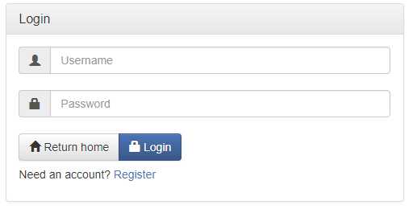

# JForum


[](https://forthebadge.com)

JForum is a forum/message board web application developed in Java EE  
Users can create an account, sign in and manage their own profile with JForum,  
add and message their friends, as well as view, create and reply to threads 

## Features
### View threads


### Create threads


### View categories


### Account Registration


### User sign-in



### Display profiles


### Add/Remove Friends


### Change account settings


## Getting Started

### Prerequisites
- JDK 1.8+
- NetBeans 8.1 + EE 
- Glassfish 4.1
- MySQL 5.7
- MySQL Connector/J
- Hibernate 4

### Installation
For a comprehensive installation guide see the [InstallGuide](install/InstallGuide.pdf)  

- Clone the jforum repository
```
git clone https://github.com/kyleruss/jforum.git
```

- Import the project in NetBeans  
Select the repository directory to open it as an enterprise application  
There should be two components: `jforum-ejb` and `jforum-war`

- Create the jforum database  
First connect to MySQL, create the database then exit

```
mysql -u root -p
CREATE DATABASE jforum;
exit
```

- Import the jforum database tables using the migration script  
The `migration.sql` script can be found in the `install` directory

```
mysql -u root -p jforum < migration.sql
```

- Add the provided `domain.xml` to your Glassfish configs  
Copy `install/domain.xml` into `<Glassfish Directory>/glassfish/domains/<your domain>/config/`

- Set the database username and password properties in your JDBC resource
Start your Glassfish server and go to your admin controls (typically `localhost:31318`)  
Select `JDBC -> JDBC Resources -> jdbc/mysql` and add the `username` and `password` properties  
where the values correspond to your MySQL database username and password

- Deploy the application  
Start the Glassfish server and then right click the jforum enterprise application and select `deploy`

## License
JForum is available under the MIT License  
See [LICENSE](LICENSE) for more details
